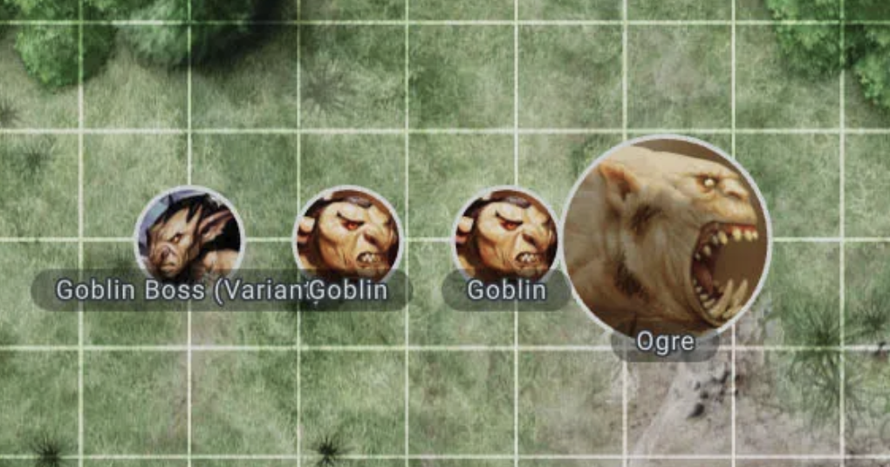

# Player Characters & Non Player Characters

Each player character can be just a circle with different colour or place for name.

Same idea about NPCs but they could be also different shapes (just not rectangles).

There is no extra information needed about them but they need to have little functionality.

## Functionality

Generally each player should be able to move his character freely.

There is no need for rules of movement as they can vastly differ between characters.

The changes in where the character is placed should be seen by other players.

It should be smooth enough that it happens in real time (no page reload needed)

Only the GM (Game Master -> Game Admin)

* is able to move around NPCs
* can choose the size of the character (circle)

### Examples

