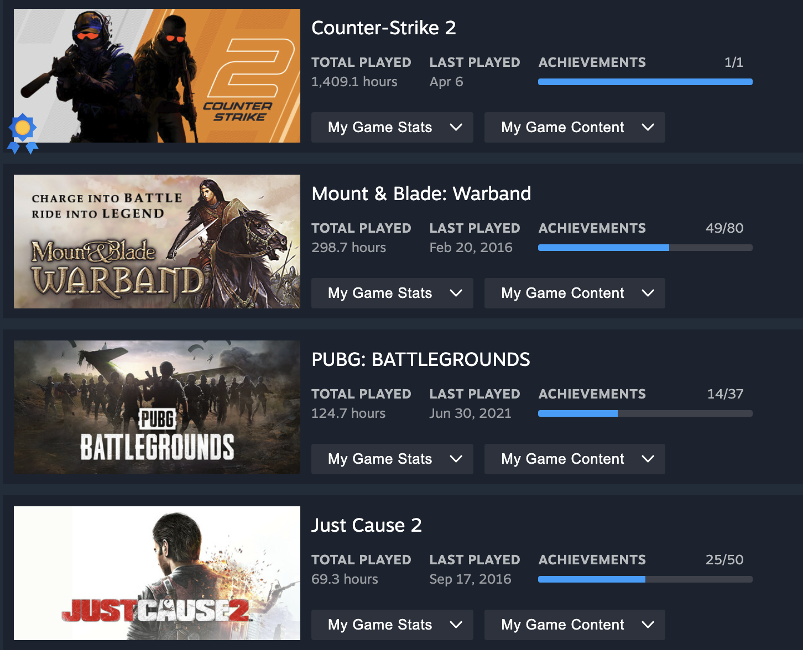

# User Stats / Profile

There is a lot of freedom in what could be here included.

That means who ever would take upon implementing it can add random things.

## Basic Idea

* Username
* Hours played (spend on website)
* List of friends
* Years of service

### Extra information

* Number of joined lobbies
* How many hours they spent in each of those lobbies
* Ways to sort the stats, last year, overall, picking the dates
* Possible showcasing the graphs that would visualise them or steam like

